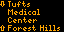

# new-mbta-trains-tidbyt

>_Initialized from my [create-tibyt-app](https://github.com/joshspicer/create-tidbyt-app) template._

A [Tidbyt](https://tidbyt.dev) app to display the live location new cars in Boston's MBTA subway system.

  

## Thanks
Utilizes the fantastic work done by the [Transit Matters train tracker](https://traintracker.transitmatters.org/).
